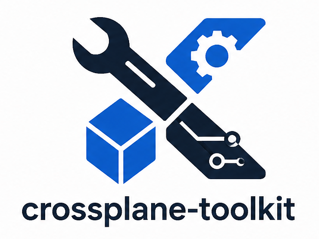

<p align="center" width="100%">
	
</p>
<p align="center" >
	
  
	
	
</p>

A monorepo for Crossplane-related libraries, functions, code generation tools, and shared API types.

Each top-level directory has a pretty specific job.

## Repository structure

| Path | What it is for |
| --- | --- |
| [functions/](./functions/) | Crossplane composition functions. |
| [modules/](./modules/) | Shared Go modules for the rest of the repository. |
| [cmd/](./cmd/) | Entry points for repo-owned CLI tools. |
| [types/](./types/) | Shared API types and schemas used by the rest of the repo. |
| [hack/](./hack/) | Internal development scripts such as local fix and verify helpers. |
| [.github/](.github/) | Automation for CI, releases, and package publishing. |

## Typical workflow

| If you want to... | Start here |
| --- | --- |
| Add a new type | [types/README.md](./types/README.md) |
| Add a new function | [functions/README.md](./functions/README.md) |
| Use `runner` inside a function | [modules/runner/README.md](./modules/runner/README.md) |
| Work on generation tooling | [cmd/gen-xrd/README.md](./cmd/gen-xrd/README.md) |

## Local checks

- Run `task install:hooks` once after cloning — it installs a pre-push git hook that auto-fixes lint and formatting before every push.
- VS Code is set up to use [golangci-lint](https://github.com/golangci/golangci-lint) on save.
- We use a [Taskfile](https://taskfile.dev) to keep the common checks in one place.
- Run `task --list` to see what is available, then pick the check you need for one function or for all of them.
- The underlying scripts live in [hack/](./hack/), following the Kubernetes/CNCF convention for internal dev tooling.
- [Taskfile.yml](./Taskfile.yml) is the real source of truth for local commands.
- [.vscode/tasks.json](./.vscode/tasks.json) is only VS Code convenience. It makes the same commands clickable from `Tasks: Run Task`, but it duplicates what the Taskfile already defines.


A few useful ones:

```sh
$ task --list
task: Available tasks for this project:
* check:function:               Run tidy, lint, and tests for one function module.
* check:functions:              Run tidy, lint, and tests for all function modules.
* check:xtenant-render:         Run checks for xtenant-render.
* check:xtenant-validate:       Run checks for xtenant-validate.
* fix:function:                 Auto-fix tidy, lint, and formatting issues for one function module.
* fix:functions:                Auto-fix tidy, lint, and formatting issues for all function modules.
* fix:xtenant-render:           Auto-fix xtenant-render.
* fix:xtenant-validate:         Auto-fix xtenant-validate.

$ task fix:xtenant-validate
$ task check:xtenant-validate
$ task check:functions
```

## Functions: build and publish

The CI automatically discovers every directory under `functions/` and runs validation (lint + tests + build) on branches and pull requests. Packaging is verified on PRs; publishing to GHCR happens automatically as part of the release flow after the release PR is merged.

Artifacts produced by the release build:

- `ghcr.io/<owner>/<name>-runtime:<version>` — distroless runtime image containing the compiled Go binary
- `ghcr.io/<owner>/function-<name>:<version>` — the `.xpkg` Crossplane package (runtime image + `package/crossplane.yaml`)

Required files per function:

```
functions/<name>/
├── Dockerfile            # two-stage: golang → distroless
├── package/
│   └── crossplane.yaml   # name + capabilities; name must match functionRef.name in Compositions
└── go.mod
```

**How to add a new function (minimal):**

1. Scaffold the function with the Crossplane CLI:
   ```sh
   crossplane xpkg init <name> function-template-go --directory functions/<name>
   ```
   This creates the `Dockerfile`, `go.mod`, `package/crossplane.yaml`, and Go boilerplate under `functions/<name>/`.
2. Add the module to `go.work` (so local CI resolves modules consistently).
3. Add a `packages` entry for `functions/<name>` in `release-please-config.json` (include `initial-version` if desired).
4. Open a PR and merge — release-please will create the release PR and tags, and CI will publish the packages automatically when the release PR is merged.

Notes:

- You do not need to create or push tags manually — release-please manages tagging and releases.
- Keep commit scopes aligned with package paths (e.g. `feat!(types/xtenant):`) so release-please picks up the right component.

## Release flow

**What's automatic vs manual:**

| Step | Who | Result |
| --- | --- | --- |
| Open release PR | release-please (on merge to `main`) | Bumped changelogs + `.release-please-manifest.json` |
| Merge release PR | **You** | GitHub Releases + tags created; build workflow dispatched automatically |
| Build and publish | CI | Runtime image + Crossplane package pushed to GHCR |

**Steps:**

1. Merge your PR to `main`; if you changed a library API, update function `go.mod` to the upcoming library version first (CI compiles fine via `go.work`)
2. Merge the release PR opened by release-please — that's it

After you merge the release PR, release-please creates the GitHub Releases and tags, and the `trigger-function-builds` job dispatches the build workflow automatically for each released function.

> Never delete and recreate a tag — bump the patch version instead.

> Commit scopes must match package paths exactly (`feat!(types/xtenant):` not `feat!(xtenant):`) or release-please misses the component.

**If something goes wrong** (workflow failed, tag already existed, etc.), dispatch the build manually:
```sh
gh workflow run "Build and publish Crossplane function packages" --ref functions/<name>/v<version>
```

**Useful commands:**
```sh
gh run list --workflow "Build and publish Crossplane function packages" --limit 10
gh run view <run-id> --log-failed
gh release list --limit 20
gh api '/users/rezakaramad/packages?package_type=container&per_page=100' \
  --jq '.[] | select(.repository.full_name == "rezakaramad/crossplane-toolkit") | .name'
```

**Version source of truth:** `release-please-config.json` (components) and `.release-please-manifest.json` (current versions).

Made with 🤓, 🐧 and 🍷.
