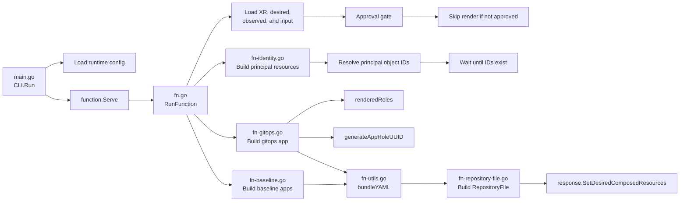

# `xtenant-render` function call graph 

This function renders the desired tenant resources after approval. It builds Entra identity resources, waits for principal object IDs to appear in observed composed resources, renders ArgoCD Applications, bundles them into YAML, and writes that bundle through a GitHub `RepositoryFile` resource.

## Overview

- `main.go`: starts the render function, loads environment-based repository configuration, discovers the Crossplane namespace, and starts the gRPC server.
- `fn.go`: orchestration entry point. It loads observed and desired resources, parses the `XTenant`, handles the approval gate, coordinates identity resolution, renders ArgoCD applications, bundles YAML, and publishes the final `RepositoryFile` resource.
- `fn-identity.go`: builds Entra resources (user/group) for each binding and resolves principal object IDs from observed composed resources.
- `fn-gitops.go`: builds `gitOps-<TENANT>` Application, including roles, bindings, and deterministic app-role UUIDs.
- `fn-baseline.go`: builds `baseline-<TENANT>` Application per unique **destination cluster**.
- `fn-repository-file.go`: builds the GitHub `RepositoryFile` composed resource that writes the bundled YAML to the export repository.
- `fn-utils.go`: shared helpers for YAML bundling and deterministic UUID generation.
- `fn-types.go`: renderer-local types and shared metadata label helper.
- `input/v1beta1/input.go`: defines the function input schema, including GitHub config, Azure principal settings, and tenant bindings.
