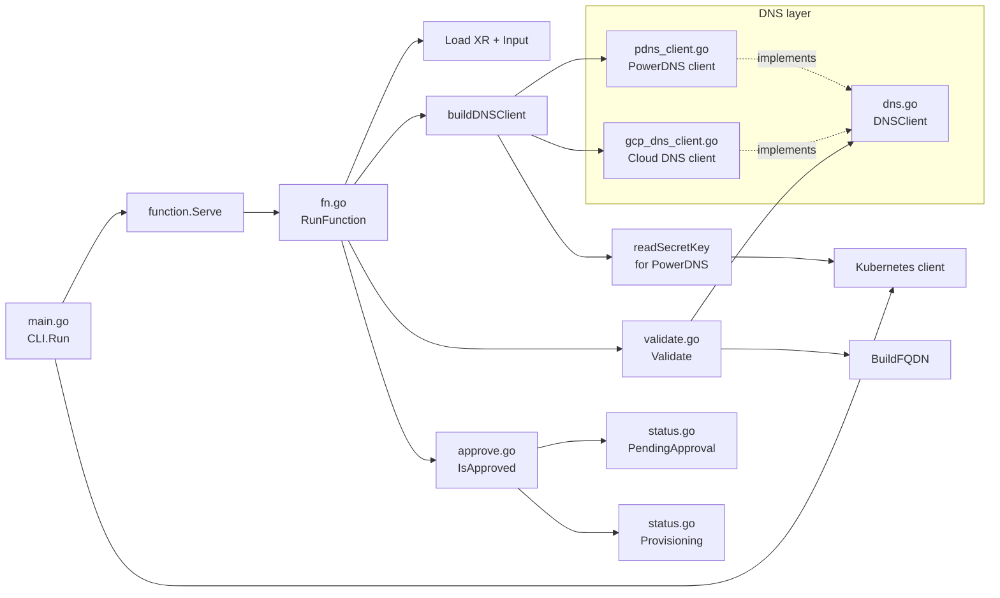

# `xtenant-validate` function call graph 

This function validates an observed `XTenant`, checks DNS availability through the configured DNS provider, and gates the tenant on approval before the next pipeline step proceeds.

## Overview

- `main.go`: bootstraps the function process, creates the Kubernetes client, and starts the gRPC server.
- `fn.go`: orchestration entry point. It reads the XR and function `input`, selects and builds the correct DNS client, invokes validation, sets XR status, and applies the approval gate.
- `validate.go`: validation logic. It builds one FQDN per workload cluster and asks the `DNSClient` whether each name is available.
- `dns.go`: defines the shared DNS interface. `Validate` uses this interface instead of calling PowerDNS or Cloud DNS directly. 
- `pdns_client.go`: PowerDNS implementation of `DNSClient`. It derives a zone from the FQDN, queries the PowerDNS zone endpoint, and inspects `rrsets`.
- `gcp_dns_client.go`: Cloud DNS implementation of `DNSClient`. It discovers a matching managed zone in the configured GCP project and scans record sets for an exact FQDN match.
- `approve.go`: encapsulates the tenant approval check.
- `status.go`: writes `status.phase` back onto the XR.
- `input/v1beta1/input.go`: defines the function input schema used by the **Composition pipeline step**.
