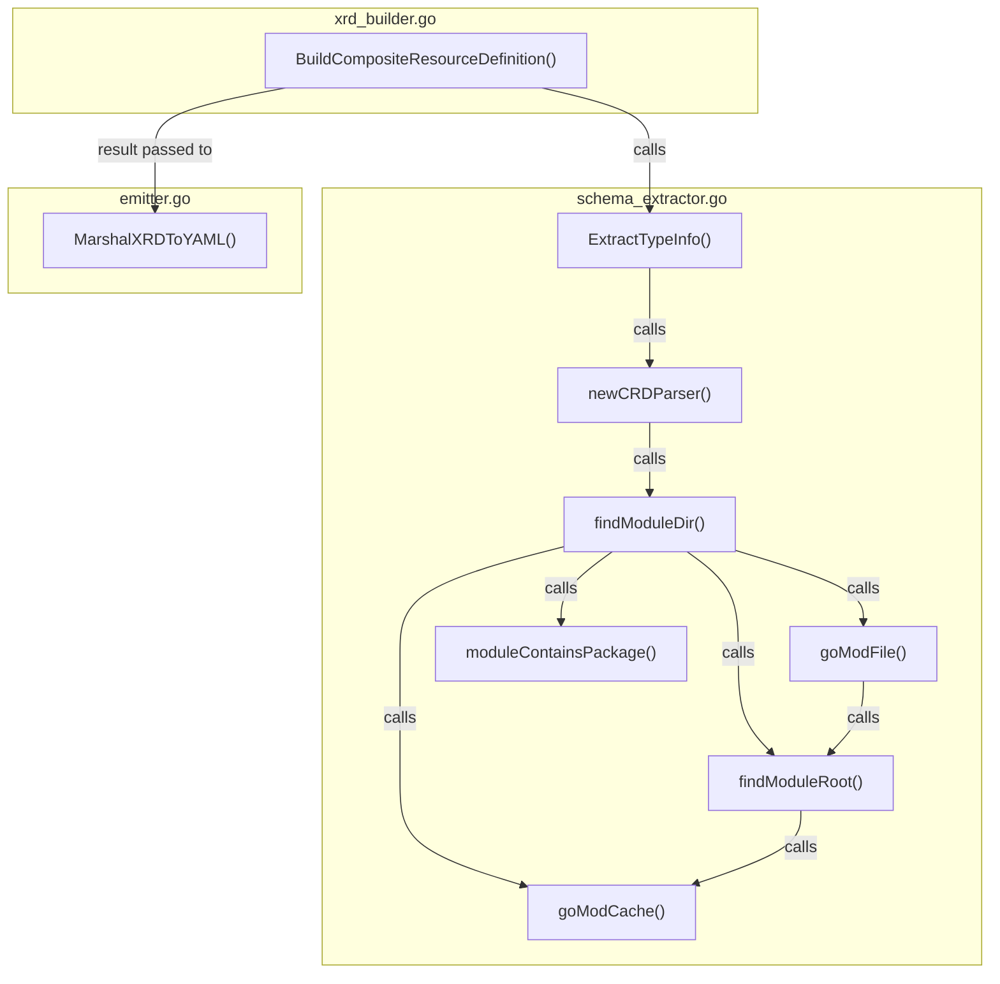

# Generator Package – Function Call Graph

```mermaid
graph TD
    subgraph xrd_builder.go
        BuildCRD["BuildCompositeResourceDefinition()"]
    end

    subgraph schema_extractor.go
        newCRDParser["newCRDParser()"]
        ExtractTypeInfo["ExtractTypeInfo()"]
        findModuleDir["findModuleDir()"]
        findModuleRoot["findModuleRoot()"]
        goModCache["goModCache()"]
        goModFile["goModFile()"]
        moduleContains["moduleContainsPackage()"]
    end

    subgraph emitter.go
        MarshalYAML["MarshalXRDToYAML()"]
    end

    BuildCRD -->|"calls"| ExtractTypeInfo
    BuildCRD -->|"result passed to"| MarshalYAML

    ExtractTypeInfo -->|"calls"| newCRDParser

    newCRDParser -->|"calls"| findModuleDir

    findModuleDir -->|"calls"| findModuleRoot
    findModuleDir -->|"calls"| goModCache
    findModuleDir -->|"calls"| goModFile
    findModuleDir -->|"calls"| moduleContains

    findModuleRoot -->|"calls"| goModCache
    goModFile -->|"calls"| findModuleRoot
```
